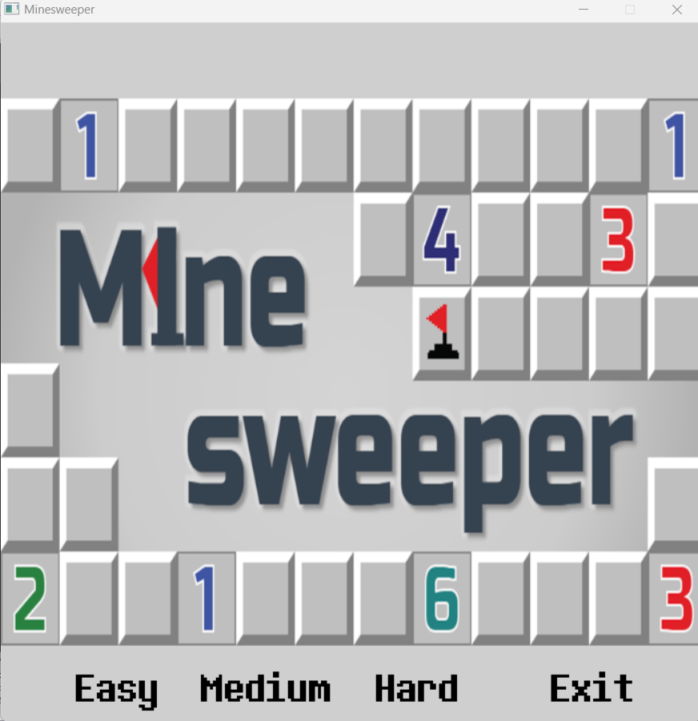
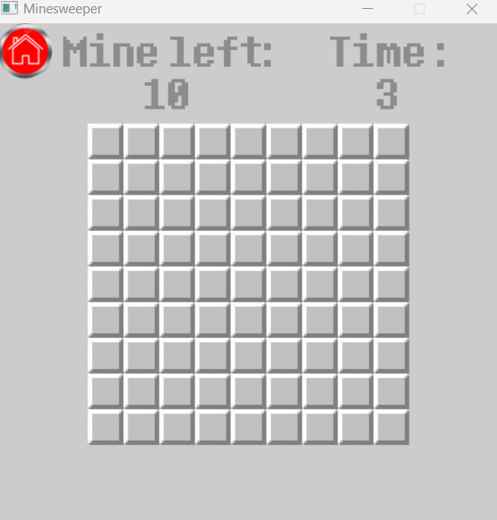
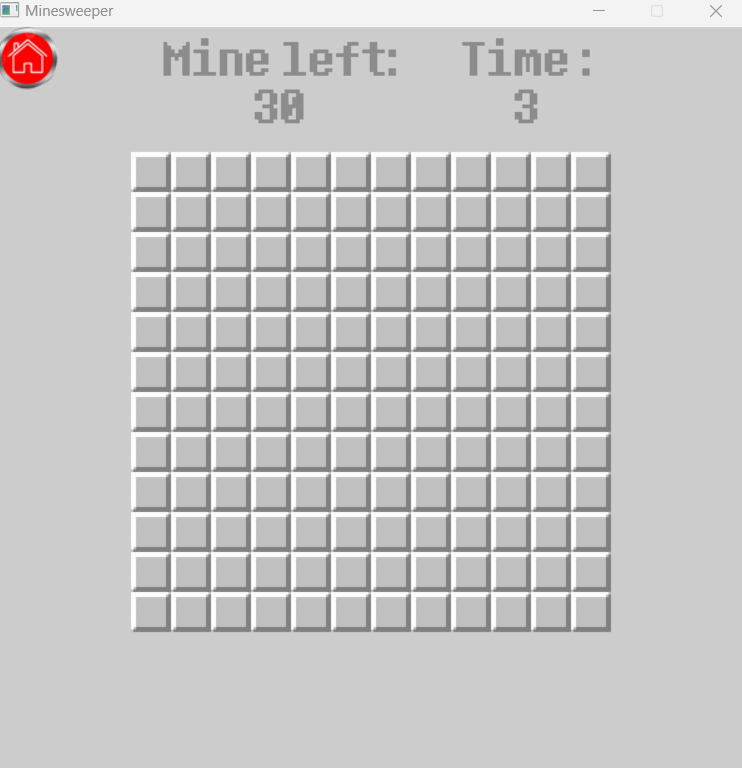
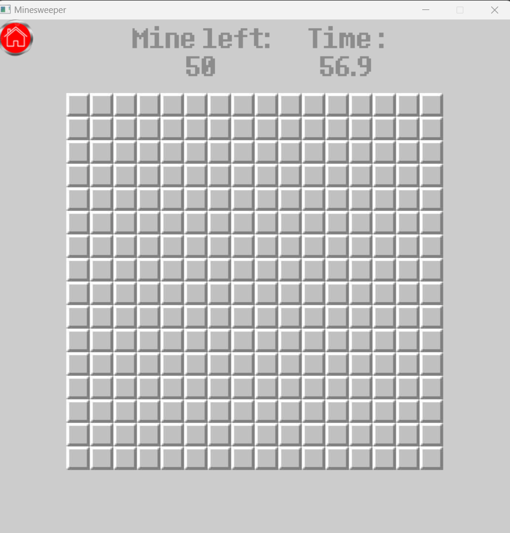
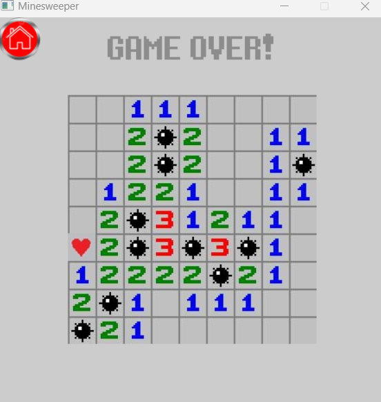
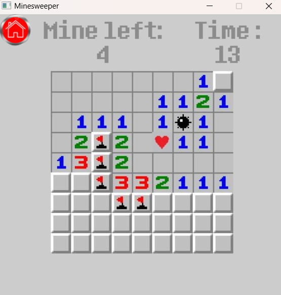

# MineSweeper

## Giới thiệu chung

*Tên sản phẩm*: MineSweeper
*Họ và tên*: Lê Thành Đạt
*MSSV*: 22028189
*Lớp học phần*: 2324H_INT2215_70

## Video Demo Game

Xem video demo tại [YouTube]().

## Giới thiệu game
Minesweeper (Dò Mìn) là một trò chơi cổ điển và đơn giản nhưng đầy thách thức, ra đời từ những năm đầu của thập kỷ 90. Đây là một trò chơi trí tuệ, yêu cầu người chơi phải sử dụng tư duy logic để tìm ra vị trí của tất cả các quả mìn ẩn trong một lưới ô vuông mà không để chúng phát nổ.

## Cách cài đặt game
### *a.Cách 1: Chơi game từ bản nén sẵn*
1. Tải file .zip tại [MineSweeper-release]([https://github.com/ducpter/GAME/releases/tag/v1.0](https://github.com/ducpter/GAME](https://github.com/lethanhdat0301/Touching_the_Treasure/releases/tag/v1.0)).
2. Giải nén file đã tải về.
3. Tìm và mở file MineSweeper.exe trong thư mục đã giải nén theo đường dẫn khởi động game.

### *b.Cách 2: Bao gồm code và có thể biên dịch*
1. *Clone repo* hoặc chọn Code -> Download Zip.
2. Mở Terminal, chạy lệnh sau để clone repo:
     git clone https://github.com/lethanhdat0301/Touching_the_Treasure.git
3. Yêu cầu:
   - Cài đặt các thư viện SDL tại https://www.libsdl.org/
   - Cài đặt MinGW phiên bản mới nhất https://sourceforge.net/projects/mingw-w64/
4. Biên dịch:
   - Mở tất cả file bằng IDE.
   - Biên dịch trò chơi.
5. Sau khi biên dịch thì file thực thi nằm trong bin/debug. Chạy file này để chơi game.

## Chi tiết về Game
### 1. Bắt đầu game
Chọn chế độ để chơi tại màn hình Menu.

### 2.Cách thành phần trong game:

- Gồm các số đếm số lượng bomb trong 8 ô lân cận từ 0 đến 8.
- Ô thứ 10 là bomb.
- Ô thứ 11 là các ô trong bảng hiện thị ban đầu.
- Ô thứ 12 là flag để đánh dấu vị trí có thể có bomb.
- Ô thứ 13 là tính năng mới, tự phát triển thêm.
### 3.Cách chơi game:
Chỉ cần click vào tất cả các ô mà bạn nghĩ rằng ô đó không chứa bomb bằng việc suy luận logic thông qua số bomb hiển thị ở từng ô.

### 4.Các chế độ chơi:
#### a.Chế độ easy

- board được khởi tạo 9x9
- Mine: 10
- Size: 450x450
- Time start: 0
- Heart Item: 1.

#### b.Chế độ medium

- board được khởi tạo 12x12
- Mine: 30
- Size: 600x600
- Time start: 0
- Heart Item: 1

#### c.Chế độ hard

- board được khởi tạo 16x16
- Mine: 50
- Size: 700x700
- Time start to countdown: 60
- Heart Item: 1

## Một vài hình ảnh từ game
- Khi gameover:
- 

-  Hình ảnh khi đang chơi:
-  

-  Hình ảnh khi chiến thắng:
-  

## Các kỹ thuật được sử dụng
- Thư viện SLD2,SLD2_image,SLD2_ttf,SDL2_mixer.
- Quản lý và chia file.
- Áp dụng kế thừa và đa hình trong lập trình hướng đối tượng.
- Tính toán chính xác vị trí của các ô hiển thị và vị trí click chuột.
- Xử lý thời gian thực, thao tác chuột, âm thanh, hình ảnh và bàn phím.

## Các nguồn tham khảo
[Lazyfoo](https://lazyfoo.net/tutorials/SDL/index.php)
[SDL Game Development](https://www.packtpub.com/en-us/product/sdl-game-development-9781849696821)
[Github-MineSweeper](https://github.com/thanhtvt/minesweeperSDL/tree/Minesweeper-(so-called)/Minesweeper_with_SDL)

## Contact:
22028189@vnu.edu.vn

